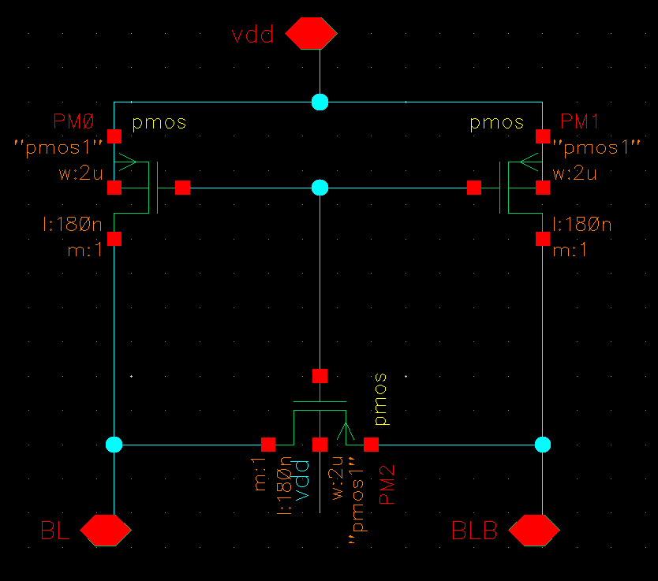
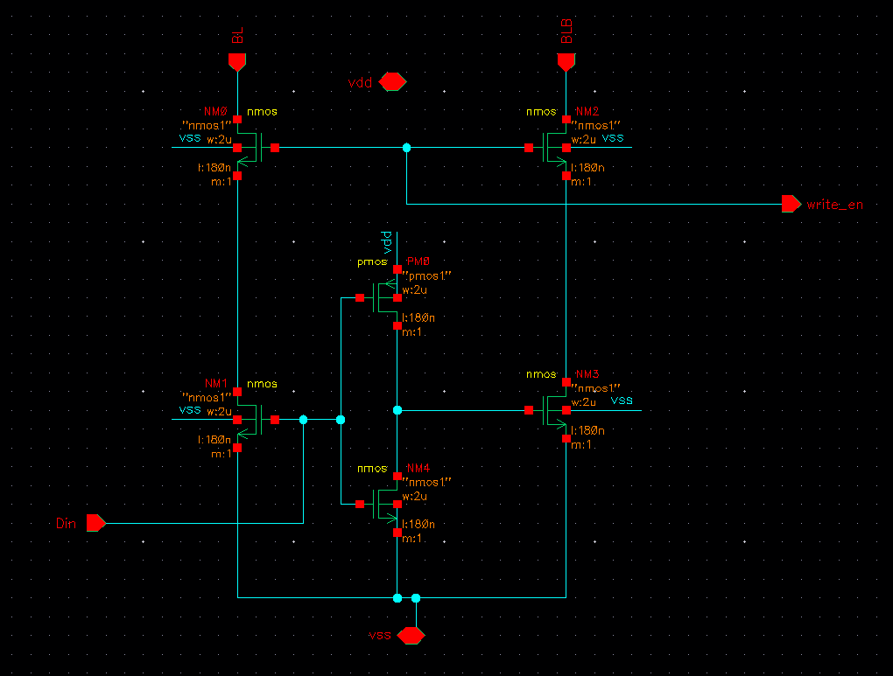
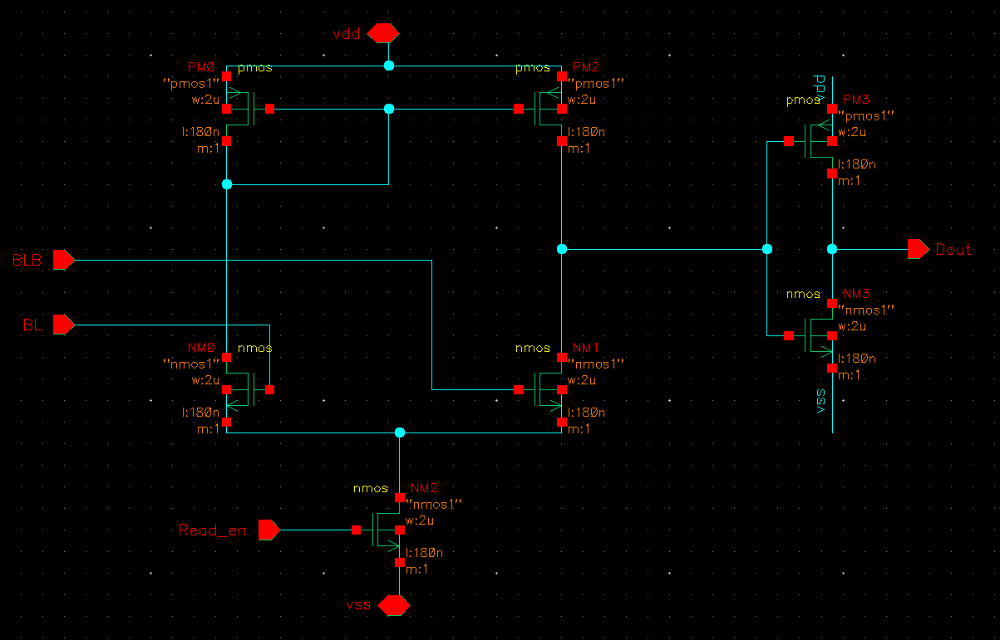
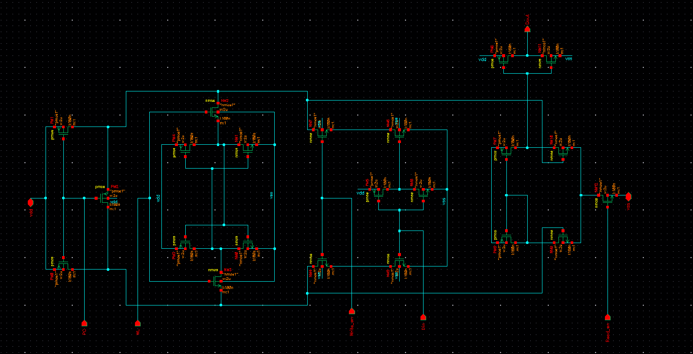

# 6T SRAM Cell Design
## Cadence Virtuoso | GPDK 180nm CMOS | Spectre ADE Simulation


---

## Overview

This project presents a complete **transistor-level design and simulation** of a 6T Static Random Access Memory (SRAM) bit-cell with all required peripheral circuits. Designed from scratch in **Cadence Virtuoso** using the **GPDK 180nm** process, the project covers the entire single-bit memory datapath — from bit-line precharging through data write and read — verified by Spectre transient simulation.

The design is organized hierarchically. Each sub-block is independently designed and simulated, then integrated into a complete **single-bit SRAM column** at the top level.

---

## Table of Contents

- [Technology Specifications](#technology-specifications)
- [Project Hierarchy](#project-hierarchy)
- [Circuit Blocks](#circuit-blocks)
  - [1. 6T SRAM Bit-Cell](#1-6t-sram-bit-cell)
  - [2. Precharge Circuit](#2-precharge-circuit)
  - [3. Write Driver](#3-write-driver)
  - [4. Sense Amplifier](#4-sense-amplifier)
  - [5. Single-Bit SRAM Column — Top Level](#5-single-bit-sram-column--top-level)
- [Simulation Results](#simulation-results)
- [Read and Write Operation — Detailed Flow](#read-and-write-operation--detailed-flow)
- [Signal Reference Table](#signal-reference-table)
- [Tools Used](#tools-used)
- [Author](#author)

---

## Technology Specifications

| Parameter            | Value              |
|----------------------|--------------------|
| Process Node         | GPDK 180nm CMOS    |
| Supply Voltage (VDD) | 1.8 V              |
| VSS                  | 0 V (GND)          |
| NMOS Model           | nmos1              |
| PMOS Model           | pmos1              |
| NMOS W / L           | 2 µm / 180 nm      |
| PMOS W / L           | 2 µm / 180 nm      |
| Multiplier (m)       | 1                  |
| Simulator            | Spectre (Cadence ADE) |
| Simulation Type      | Transient          |
| Simulation Duration  | 0 – 500 ns         |

---

## Project Hierarchy

The project follows a bottom-up design methodology. Each block is created and verified individually before being instantiated in the top-level testbench.

```
6T_SRAM_singlebit            ← Top-level single-bit SRAM column
│
├── 6T_SRAM_PC               ← Precharge circuit (3T PMOS)
│
├── 6T_SRAM_cell             ← 6T SRAM bit-cell (core storage)
│
├── 6T_SRAM_Write_en         ← Write driver (differential bit-line forcing)
│
└── 6T_SRAM_sense_amplifier  ← Sense amplifier (latch-type + output buffer)
```

All sub-blocks share the internal **BL** (bit-line) and **BLB** (complementary bit-line) nets. Control is through external signals: PC, WL, Write_en, Read_en, and Din.

---

## Circuit Blocks

---

### 1. 6T SRAM Bit-Cell


#### What it is

The 6T bit-cell is the **core storage element** of the SRAM. It uses 6 MOSFET transistors to store one bit of data as a voltage state on internal nodes Q and Qbar. It is the most area-critical cell in any SRAM design and must be sized to meet read stability, write-ability, and hold-state noise margin constraints simultaneously.

#### Transistor Breakdown

| Transistor | Type  | W / L         | Function                                         |
|------------|-------|---------------|--------------------------------------------------|
| PM0        | PMOS  | 2µm / 180nm   | Pull-up load transistor — left side inverter     |
| NM0        | NMOS  | 2µm / 180nm   | Pull-down driver — left side inverter            |
| PM1        | PMOS  | 2µm / 180nm   | Pull-up load transistor — right side inverter    |
| NM1        | NMOS  | 2µm / 180nm   | Pull-down driver — right side inverter           |
| NM2        | NMOS  | 2µm / 180nm   | Access transistor — connects Q node to BL        |
| NM3        | NMOS  | 2µm / 180nm   | Access transistor — connects Qbar node to BLB    |

#### Circuit Topology

The cell is organized as two **cross-coupled CMOS inverters**:

- **Left inverter:** PM0 (PMOS load) + NM0 (NMOS driver). Output = Q node.
- **Right inverter:** PM1 (PMOS load) + NM1 (NMOS driver). Output = Qbar node.
- The output of the left inverter (Q) feeds the input of the right inverter, and vice versa — this forms the **positive feedback bistable latch** that stores data.

**Access transistors** NM2 and NM3 are NMOS pass gates controlled by the **Word Line (WL)**:
- WL = HIGH → NM2 and NM3 turn ON → Q connects to BL, Qbar connects to BLB → cell is accessible for read or write.
- WL = LOW → NM2 and NM3 turn OFF → cell is isolated from the bit-lines → stored data is retained by the latch feedback loop.

#### Key Behavior

- **Hold state (WL = LOW):** The cross-coupled latch sustains Q = VDD, Qbar = VSS (or vice versa) indefinitely as long as power is supplied. No current flows (static CMOS), making SRAM low-power in standby.
- **Read access (WL = HIGH):** The cell develops a small differential voltage (ΔV) on BL and BLB. The sense amplifier detects and amplifies this ΔV.
- **Write access (WL = HIGH):** The write driver overrides the latch's feedback by forcing a strong differential on BL and BLB, flipping Q and Qbar to the new data value.

---

### 2. Precharge Circuit



#### What it is

The precharge circuit **initializes the bit-lines to VDD** before every read or write cycle. This ensures both BL and BLB start at the same known voltage, which is critical for correct differential sensing during reads and reliable data forcing during writes.

#### Transistor Breakdown

| Transistor | Type  | W / L       | Function                                           |
|------------|-------|-------------|----------------------------------------------------|
| PM0        | PMOS  | 2µm / 180nm | Charges BL to VDD when PC = LOW                   |
| PM1        | PMOS  | 2µm / 180nm | Charges BLB to VDD when PC = LOW                  |
| PM2        | PMOS  | 2µm / 180nm | Equalizer — shorts BL to BLB; gate tied to VDD    |

#### Circuit Topology

All three transistors are **PMOS**, controlled (directly or indirectly) by the **PC (Precharge)** signal:

- **PM0:** Source tied to VDD, drain to BL, gate tied to PC. Turns ON when PC = LOW (PMOS active-low gate), pulling BL toward VDD.
- **PM1:** Source tied to VDD, drain to BLB, gate tied to PC. Turns ON when PC = LOW, pulling BLB toward VDD.
- **PM2:** Source and drain connected across BL–BLB, gate connected to the shared VDD node. Acts as an equalizer — any small residual differential between BL and BLB is eliminated before the access cycle begins.

#### Key Behavior

- **PC = LOW (active):** PM0 and PM1 charge BL = BLB = VDD. PM2 actively equalizes any mismatch. Ensures a symmetric starting point for the bit-lines.
- **PC = HIGH (inactive):** All three PMOS transistors turn OFF. Bit-lines are released and float at VDD, ready for the cell to develop a differential during read or for the write driver to force data during write.
- Without precharging, residual charge from a previous cycle could corrupt the next read or write operation.

---

### 3. Write Driver



#### What it is

The write driver is responsible for **overwriting the data stored in the 6T latch**. It forces a strong, fully differential voltage on BL and BLB based on the input data bit (Din), strong enough to overcome the regenerative feedback of the cross-coupled inverters inside the cell.

#### Transistor Breakdown

| Transistor | Type  | W / L       | Function                                                  |
|------------|-------|-------------|-----------------------------------------------------------|
| NM0        | NMOS  | 2µm / 180nm | Pull-down — pulls BL toward VSS during write              |
| NM1        | NMOS  | 2µm / 180nm | Din-controlled — sets the write direction                 |
| NM2        | NMOS  | 2µm / 180nm | Pull-down — pulls BLB toward VSS during write             |
| NM3        | NMOS  | 2µm / 180nm | Complements NM1 — drives the opposite bit-line            |
| PM0        | PMOS  | 2µm / 180nm | Weak pull-up — signal conditioning when driver is idle    |
| NM4        | NMOS  | 2µm / 180nm | Write enable gate — series enable transistor (Write_en)   |

#### Circuit Topology

The write driver uses an **NMOS pull-down stack** to overwrite the cell:

- **NM4** is the write enable gate. It is only active when **Write_en = HIGH**, allowing current to flow through the driver.
- **NM1** is controlled by **Din**. Based on Din's logic level, NM1 and NM3 create a complementary pull-down path — one for BL and one for BLB.
- When Din = HIGH: BL is pulled LOW (through NM0/NM1/NM4), BLB stays HIGH from precharge. The 6T cell sees BL = 0, BLB = 1 → writes Q = 0, Qbar = 1.
- When Din = LOW: BLB is pulled LOW (through NM2/NM3/NM4), BL stays HIGH. The cell sees BL = 1, BLB = 0 → writes Q = 1, Qbar = 0.
- **PM0** provides a weak pull-up path to prevent floating nodes when the driver is OFF (Write_en = LOW).

#### Key Behavior

- Write_en = LOW → driver OFF, bit-lines unaffected.
- Write_en = HIGH → driver forces differential on BL/BLB based on Din → latch overwritten.
- The NMOS pull-down must be sized stronger than the cell's pull-up PMOS (PM0/PM1 in the bit-cell) to successfully flip the stored data — this is the **write-ability constraint**.

---

### 4. Sense Amplifier



#### What it is

During a read operation, the 6T cell develops only a small differential voltage (ΔV, typically 100–200mV) on the bit-lines before the sense amplifier is triggered. The sense amplifier **amplifies this small ΔV to a full logic swing (0 to VDD)** and drives the output **Dout**.

This design implements a **latch-type (cross-coupled) differential sense amplifier** with a CMOS output inverter buffer.

#### Transistor Breakdown

| Transistor | Type  | W / L       | Function                                                  |
|------------|-------|-------------|-----------------------------------------------------------|
| PM0        | PMOS  | 2µm / 180nm | Cross-coupled PMOS load — left side of latch             |
| PM2        | PMOS  | 2µm / 180nm | Cross-coupled PMOS load — right side of latch            |
| NM0        | NMOS  | 2µm / 180nm | Differential input transistor — senses BLB               |
| NM1        | NMOS  | 2µm / 180nm | Differential input transistor — senses BL                |
| NM2        | NMOS  | 2µm / 180nm | Tail transistor — current source, enabled by Read_en     |
| PM3        | PMOS  | 2µm / 180nm | Output inverter buffer — PMOS half                       |
| NM3        | NMOS  | 2µm / 180nm | Output inverter buffer — NMOS half, drives Dout          |

#### Circuit Topology

The sense amplifier consists of two stages:

**Stage 1 — Latch-type differential amplifier:**
- NM0 and NM1 form the input differential pair, with their gates connected to BLB and BL respectively.
- PM0 and PM2 are cross-coupled PMOS loads — the gate of PM0 is connected to the drain of PM2, and vice versa — creating regenerative positive feedback.
- NM2 is the **tail enable transistor** controlled by **Read_en**. When Read_en = HIGH, NM2 turns ON, connecting the common source of NM0/NM1 to VSS and activating the amplifier.

**Stage 2 — CMOS output inverter (PM3 + NM3):**
- Buffers and inverts the amplified output of the latch to drive **Dout** at full logic levels.

#### Key Behavior

- **Read_en = LOW:** NM2 is OFF. No current flows through the differential pair. Sense amplifier is disabled.
- **Read_en = HIGH:** NM2 turns ON. The small ΔV on BL/BLB is sensed by NM0/NM1. The cross-coupled PMOS loads (PM0/PM2) regeneratively amplify the difference to a full VDD/VSS swing in nanoseconds.
- The output inverter (PM3+NM3) produces **Dout = stored bit value**.
- Enabling the sense amplifier too early (before sufficient ΔV develops) can cause a wrong read — the **Read_en timing** must allow the cell to develop adequate differential voltage first.

---

### 5. Single-Bit SRAM Column — Top Level



#### What it is

The top-level schematic is the **complete single-bit SRAM column**, integrating all four peripheral sub-blocks with the 6T bit-cell. This is the final design block that is simulated in the transient testbench.

#### Integration Overview

All sub-blocks are connected through shared internal nets:

| Internal Net | Connected Blocks                                     |
|--------------|------------------------------------------------------|
| BL           | Precharge (PM0), 6T Cell (NM2), Write Driver (NM0), Sense Amp (NM1) |
| BLB          | Precharge (PM1), 6T Cell (NM3), Write Driver (NM2), Sense Amp (NM0) |
| Q            | 6T Cell internal node (output of left inverter)      |
| Qbar         | 6T Cell internal node (output of right inverter)     |

#### External Control Signals

| Signal    | Drives                          |
|-----------|---------------------------------|
| PC        | Precharge circuit (PM0, PM1, PM2) |
| WL        | 6T bit-cell access transistors (NM2, NM3) |
| Din       | Write driver input              |
| Write_en  | Write driver enable             |
| Read_en   | Sense amplifier tail transistor (NM2) |
| Dout      | Output from sense amplifier buffer |

#### Complete Operation Sequence

```
╔══════════════════════════════════════════════════════════╗
║              SRAM SINGLE-BIT COLUMN TIMING               ║
╠═══════════╦═══════════╦════════════╦═════════════════════╣
║  Phase    ║  PC       ║  WL        ║  Action              ║
╠═══════════╬═══════════╬════════════╬═════════════════════╣
║ Precharge ║  LOW      ║  LOW       ║ BL=BLB=VDD          ║
║ Setup     ║  HIGH     ║  LOW       ║ Bit-lines float@VDD  ║
║ Write     ║  HIGH     ║  HIGH      ║ Write_en=H, Din=data ║
║ Read      ║  HIGH     ║  HIGH      ║ Read_en=H → Dout     ║
║ Hold      ║  HIGH     ║  LOW       ║ Cell isolated        ║
╚═══════════╩═══════════╩════════════╩═════════════════════╝
```

---

## Simulation Results

Transient simulation performed in **Cadence Spectre ADE** from 0 to 500 ns.
The testbench exercises a **4-word × 4-bit memory array** (16-bit total) with:
- 2-bit address bus (A0, A1) → selects 1 of 4 word-lines
- 4-bit data input bus (Din0–Din3)
- 4-bit data output bus (D0–D3)
- Control signals: PC, E, Write_en, Read_en


### Detailed Signal-by-Signal Analysis

| Signal      | Waveform Behavior                                                                                         | Inference |
|-------------|-----------------------------------------------------------------------------------------------------------|-----------|
| `/PC`       | Periodic active-HIGH pulses (~20ns period). Goes LOW briefly each cycle.                                 | Precharge activates at the start of every cycle. BL and BLB are recharged to VDD. |
| `/A0`       | Stays LOW from 0 to ~180ns, then transitions HIGH and stays HIGH.                                        | Address bit 0 selects Word-Line 0 for the first half of simulation, then Word-Line 1 for the second half. |
| `/A1`       | Toggles between LOW and HIGH mid-simulation.                                                              | Address bit 1 changes the selected row, confirming multi-address testing. |
| `/E`        | Periodic toggling signal, roughly half-period of PC.                                                     | Chip enable — gates all memory access operations. |
| `/Write_en` | Narrow positive pulses appearing after PC goes HIGH.                                                     | Write cycles are short and occur after precharge completes. Correct sequencing verified. |
| `/Din0`     | Toggles HIGH during write cycles.                                                                         | Data input bit 0 = 1 is being written to the selected cell in those cycles. |
| `/Read_en`  | Wider positive pulses, occurring after Write_en pulses in each cycle.                                    | Read occurs after write in every cycle. Read_en pulse width allows ΔV to develop on bit-lines before SA triggers. |
| `/D0`       | Transitions to ~2.04V after corresponding Write_en + Read_en sequence.                                   | Output bit 0 correctly reads back the written data. Confirms write driver and sense amplifier are functioning. |
| `/Din1`     | Held constant at ~1.58V (midpoint, not toggled).                                                         | Bit 1 data input is not exercised in this testbench run. Expected flat line — not a fault. |
| `/D1`       | Shows clean transitions during read cycles for bit 1.                                                    | Sense amplifier for bit 1 is functional; D1 correctly outputs the previously stored bit. |
| `/Din2`     | Held at ~1.2V throughout (not toggled).                                                                  | Bit 2 input not driven — held at intermediate voltage. D2 behavior reflects this. |
| `/D2`       | Narrow intermittent pulses.                                                                               | These are expected residual outputs since Din2 was never properly written. Not a circuit failure. |
| `/Din3`     | Toggles periodically — cleaner pattern, approximately every 100ns.                                       | Bit 3 is actively written with alternating data values. |
| `/D3`       | Follows Din3 with correct read-back after each write cycle.                                              | Confirms bit 3 write and read operation is fully correct. |

### Key Verification Results

| Verification Check                            | Result |
|-----------------------------------------------|--------|
| Precharge completes before WL assertion        | ✅ Pass |
| Write_en precedes Read_en in every cycle       | ✅ Pass |
| D0 correctly reads back Din0                  | ✅ Pass |
| D3 correctly reads back Din3                  | ✅ Pass |
| Multiple address rows exercised (A0, A1)       | ✅ Pass |
| Sense amplifier output reaches full swing      | ✅ Pass |
| Din1, Din2 flat lines (not driven intentionally) | ℹ️ Expected |

---

## Read and Write Operation — Detailed Flow

### Write Operation

```
Cycle Start
    │
    ▼
[1] PC = LOW
    → PM0, PM1 turn ON → BL = BLB = VDD
    → PM2 equalizes any residual ΔV between BL and BLB
    │
    ▼
[2] PC = HIGH
    → Precharge transistors OFF
    → BL and BLB float at VDD (hold charge)
    │
    ▼
[3] WL = HIGH
    → NM2 (BL side) and NM3 (BLB side) access transistors turn ON
    → Q connected to BL, Qbar connected to BLB
    │
    ▼
[4] Write_en = HIGH, Din = input data
    → If Din = 1: Write driver pulls BL → VSS, BLB stays at VDD
    → If Din = 0: Write driver pulls BLB → VSS, BL stays at VDD
    → Strong differential overrides the 6T latch feedback
    │
    ▼
[5] 6T latch flips to new state
    → Q = Din, Qbar = ~Din stored
    │
    ▼
[6] Write_en = LOW → Driver disabled
    WL = LOW → Cell isolated
    → New data held by cross-coupled latch indefinitely
```

### Read Operation

```
Cycle Start
    │
    ▼
[1] PC = LOW
    → BL = BLB = VDD (precharge + equalize)
    │
    ▼
[2] PC = HIGH
    → Bit-lines float at VDD
    │
    ▼
[3] WL = HIGH
    → Access transistors NM2, NM3 turn ON
    → Cell connects to bit-lines
    │
    ▼
[4] Cell develops ΔV on bit-lines
    → If Q = 0: NM0 (left pull-down) pulls BL slightly below VDD
    → BLB remains at VDD (Qbar = 1, NM1 OFF)
    → Small ΔV = BLB − BL develops (typically 100–200mV)
    │
    ▼
[5] Read_en = HIGH
    → NM2 (tail transistor) in sense amplifier turns ON
    → Differential pair (NM0/NM1 in SA) senses ΔV on BL/BLB
    → Cross-coupled PMOS (PM0/PM2) regeneratively amplifies ΔV
    → Full rail-to-rail swing achieved in nanoseconds
    │
    ▼
[6] Output inverter (PM3 + NM3) drives Dout
    → Dout = Q (stored bit value)
    │
    ▼
[7] Read_en = LOW → SA disabled
    WL = LOW → Cell isolated
    → Read complete, data not disturbed
```

---

## Signal Reference Table

| Signal    | Direction | Active Level | Description                                          |
|-----------|-----------|--------------|------------------------------------------------------|
| PC        | Input     | LOW          | Precharge control — active LOW charges BL/BLB        |
| WL        | Input     | HIGH         | Word line — enables cell access when HIGH            |
| A0        | Input     | —            | Address bit 0 — selects memory row                  |
| A1        | Input     | —            | Address bit 1 — selects memory row                  |
| E         | Input     | HIGH         | Chip enable                                          |
| Write_en  | Input     | HIGH         | Write enable — activates write driver                |
| Read_en   | Input     | HIGH         | Read enable — activates sense amplifier              |
| Din0–Din3 | Input     | —            | 4-bit parallel data input bus                        |
| D0–D3     | Output    | —            | 4-bit parallel data output bus                       |
| BL        | Internal  | —            | Bit-line — connects to Q node via NM2 (access TX)   |
| BLB       | Internal  | —            | Complementary bit-line — connects to Qbar via NM3   |
| Q         | Internal  | —            | True storage node — output of left inverter          |
| Qbar      | Internal  | —            | Complement storage node — output of right inverter   |
| Dout      | Output    | —            | Sense amplifier output — buffered read data          |

---

## Tools Used

| Tool                     | Purpose                                         |
|--------------------------|-------------------------------------------------|
| Cadence Virtuoso ADE     | Schematic capture, hierarchy, simulation setup  |
| Cadence Spectre          | Transient circuit simulation engine             |
| GPDK 180nm PDK           | MOSFET models: nmos1, pmos1 (W=2µm, L=180nm)  |
| Assura DRC / LVS         | Design rule check and layout vs. schematic      |

---

## Author

**Kaushik T**
B.E. Electronics and Communication Engineering (Graduating 2029)
Chennai Institute of Technology, Kundrathur, Chennai
GitHub: [@Raghul-2025](https://github.com/Raghul-2025)
Email: kaushik7t7@gmail.com
