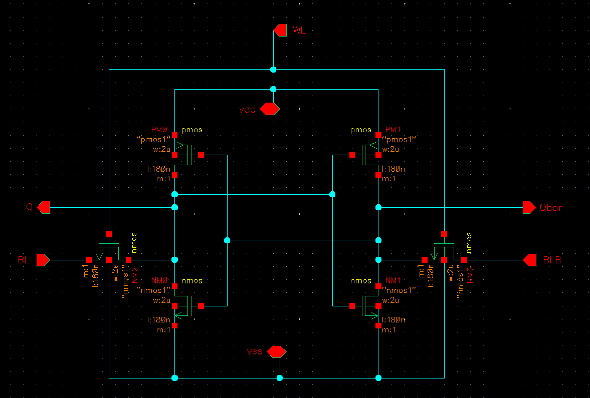
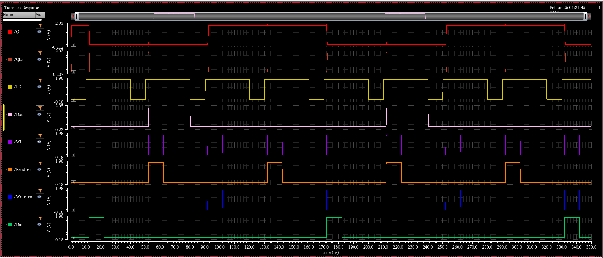

# 6T SRAM Cell Design
## Cadence Virtuoso | GPDK 180nm CMOS | Spectre Transient Simulation


---

## Overview

A complete **transistor-level design and simulation** of a 6T Static Random Access Memory (SRAM) bit-cell with all peripheral circuits, implemented in **Cadence Virtuoso** using the **GPDK 180nm** CMOS process.

The design covers the full single-bit SRAM memory datapath — precharge circuit, 6T storage cell, write driver, and sense amplifier — all integrated into a **single-bit SRAM column** and verified through Spectre transient simulation. The simulation directly shows the internal storage nodes **Q** and **Qbar** toggling correctly across multiple write and read cycles, confirming correct circuit operation at the bit-cell level.

---

## Table of Contents

- [Technology Specifications](#technology-specifications)
- [Project Hierarchy](#project-hierarchy)
- [Circuit Blocks](#circuit-blocks)
  - [1. 6T SRAM Bit-Cell](#1-6t-sram-bit-cell)
  - [2. Precharge Circuit](#2-precharge-circuit)
  - [3. Write Driver](#3-write-driver)
  - [4. Sense Amplifier](#4-sense-amplifier)
  - [5. Single-Bit SRAM Column — Top Level](#5-single-bit-sram-column--top-level)
- [Simulation Results](#simulation-results)
- [Read and Write Operation](#read-and-write-operation)
- [Signal Reference Table](#signal-reference-table)
- [Tools Used](#tools-used)
- [Author](#author)

---

## Technology Specifications

| Parameter            | Value                  |
|----------------------|------------------------|
| Process Node         | GPDK 180nm CMOS        |
| Supply Voltage (VDD) | 1.8 V                  |
| VSS                  | 0 V (GND)              |
| NMOS Model           | nmos1                  |
| PMOS Model           | pmos1                  |
| NMOS W / L           | 2 µm / 180 nm          |
| PMOS W / L           | 2 µm / 180 nm          |
| Multiplier (m)       | 1                      |
| Simulator            | Cadence Spectre (ADE)  |
| Simulation Type      | Transient              |
| Simulation Duration  | 0 – 350 ns             |

---

## Project Hierarchy

The design follows a **bottom-up methodology** — each block is independently verified before being instantiated in the top-level column.

```
6T_SRAM_singlebit                  ← Top-level: complete single-bit SRAM column
│
├── 6T_SRAM_PC                     ← Precharge circuit (3-PMOS)
│
├── 6T_SRAM_cell                   ← 6T SRAM bit-cell (core latch)
│
├── 6T_SRAM_Write_en               ← Write driver (differential forcing)
│
└── 6T_SRAM_sense_amplifier        ← Sense amplifier (latch-type + output buffer)
```

All sub-blocks share the internal **BL** (bit-line) and **BLB** (complementary bit-line) nets. The single external data output is **Dout**, produced by the sense amplifier.

---

## Circuit Blocks

---

### 1. 6T SRAM Bit-Cell



#### What It Is

The 6T bit-cell is the **core storage element** of the SRAM. It stores one bit of data as a stable voltage at internal nodes **Q** and **Qbar** using 6 MOSFET transistors. It is the most critical cell in any SRAM — its sizing must simultaneously satisfy read stability, write-ability, and hold-state noise margin requirements.

#### Transistor Breakdown

| Transistor | Type  | W / L       | Role                                            |
|------------|-------|-------------|--------------------------------------------------|
| PM0        | PMOS  | 2µm / 180nm | Pull-up load — left inverter                    |
| NM0        | NMOS  | 2µm / 180nm | Pull-down driver — left inverter                |
| PM1        | PMOS  | 2µm / 180nm | Pull-up load — right inverter                   |
| NM1        | NMOS  | 2µm / 180nm | Pull-down driver — right inverter               |
| NM2        | NMOS  | 2µm / 180nm | Access transistor — connects Q node to BL       |
| NM3        | NMOS  | 2µm / 180nm | Access transistor — connects Qbar node to BLB   |

#### How It Works

The cell is built from two **cross-coupled CMOS inverters**:

- **Left inverter:** PM0 (PMOS load) + NM0 (NMOS driver) → output is node **Q**
- **Right inverter:** PM1 (PMOS load) + NM1 (NMOS driver) → output is node **Qbar**
- Q feeds the input of the right inverter; Qbar feeds the input of the left inverter — this **positive feedback loop** creates a bistable latch that holds data indefinitely as long as power is supplied.

**Access transistors NM2 and NM3** are NMOS pass gates controlled by **WL (Word Line)**:
- **WL = HIGH:** NM2 and NM3 turn ON → Q connects to BL, Qbar connects to BLB → cell is accessible for read or write.
- **WL = LOW:** NM2 and NM3 turn OFF → cell is isolated → stored data held by latch feedback, zero static power consumed.

---

### 2. Precharge Circuit


#### What It Is

The precharge circuit **initializes both bit-lines to VDD** before every access cycle. This ensures a clean, symmetric starting condition on BL and BLB, which is essential for correct differential sensing during reads and reliable write operations.

#### Transistor Breakdown

| Transistor | Type  | W / L       | Role                                              |
|------------|-------|-------------|---------------------------------------------------|
| PM0        | PMOS  | 2µm / 180nm | Charges BL to VDD when PC = LOW                  |
| PM1        | PMOS  | 2µm / 180nm | Charges BLB to VDD when PC = LOW                 |
| PM2        | PMOS  | 2µm / 180nm | Equalizer — shorts BL to BLB, gate tied to VDD   |

#### How It Works

All three transistors are PMOS and are activated when **PC = LOW** (active-low control):

- **PM0** pulls BL → VDD.
- **PM1** pulls BLB → VDD.
- **PM2** equalizes any residual differential voltage between BL and BLB, ensuring both lines start at exactly the same level before the next access cycle.

When **PC = HIGH**, all three transistors turn OFF and the bit-lines float at VDD, ready for the cell to develop a read differential or for the write driver to force data.

---

### 3. Write Driver


#### What It Is

The write driver **forces a strong differential voltage onto BL and BLB** based on the input data bit (Din). This differential must be strong enough to overcome the regenerative feedback of the cross-coupled latch inside the 6T cell and flip the stored data.

#### Transistor Breakdown

| Transistor | Type  | W / L       | Role                                                       |
|------------|-------|-------------|-------------------------------------------------------------|
| NM0        | NMOS  | 2µm / 180nm | Pulls BL toward VSS during write                           |
| NM1        | NMOS  | 2µm / 180nm | Din-controlled — sets write polarity                       |
| NM2        | NMOS  | 2µm / 180nm | Pulls BLB toward VSS during write                          |
| NM3        | NMOS  | 2µm / 180nm | Complements NM1 — drives opposite bit-line                 |
| PM0        | PMOS  | 2µm / 180nm | Weak pull-up for signal conditioning when driver is idle   |
| NM4        | NMOS  | 2µm / 180nm | Series enable gate — activated by Write_en                 |

#### How It Works

- **Write_en = LOW:** NM4 is OFF. Driver is completely disabled. Bit-lines are unaffected.
- **Write_en = HIGH:** NM4 turns ON, enabling the driver.
  - If **Din = 1:** BL is pulled LOW through the NMOS stack; BLB stays at VDD from precharge → cell writes Q = 0, Qbar = 1.
  - If **Din = 0:** BLB is pulled LOW; BL stays at VDD → cell writes Q = 1, Qbar = 0.
- PM0 provides a weak pull-up to prevent floating internal nodes when the driver is OFF.

---

### 4. Sense Amplifier


#### What It Is

During a read, the 6T cell develops only a small differential voltage (ΔV ≈ 100–200mV) on BL and BLB before the sense amplifier is triggered. The sense amplifier **amplifies this small ΔV to a full logic swing** (0 to ~1.8V) and drives the output **Dout**.

This design uses a **latch-type cross-coupled differential sense amplifier** followed by a CMOS inverter output buffer.

#### Transistor Breakdown

| Transistor | Type  | W / L       | Role                                                  |
|------------|-------|-------------|-------------------------------------------------------|
| PM0        | PMOS  | 2µm / 180nm | Cross-coupled PMOS load — left side of latch         |
| PM2        | PMOS  | 2µm / 180nm | Cross-coupled PMOS load — right side of latch        |
| NM0        | NMOS  | 2µm / 180nm | Differential input — senses BLB                      |
| NM1        | NMOS  | 2µm / 180nm | Differential input — senses BL                       |
| NM2        | NMOS  | 2µm / 180nm | Tail transistor — current enable, controlled by Read_en |
| PM3        | PMOS  | 2µm / 180nm | Output inverter buffer — PMOS half                   |
| NM3        | NMOS  | 2µm / 180nm | Output inverter buffer — NMOS half, drives Dout      |

#### How It Works

**Stage 1 — Differential latch amplifier:**
- NM0 and NM1 form the differential input pair, sensing BLB and BL respectively.
- PM0 and PM2 are cross-coupled PMOS loads providing regenerative amplification.
- NM2 is the **tail enable transistor**. When **Read_en = HIGH**, NM2 connects the differential pair to VSS, activating the amplifier.
- The small ΔV between BL and BLB is rapidly amplified to a full rail-to-rail swing through positive feedback.

**Stage 2 — CMOS output inverter (PM3 + NM3):**
- Buffers and inverts the amplified latch output to produce **Dout** at full logic levels.

- **Read_en = LOW:** SA is disabled, Dout is in a high-impedance or previous state.
- **Read_en = HIGH:** SA activates, amplifies ΔV → Dout = stored bit Q.

---

### 5. Single-Bit SRAM Column — Top Level


#### What It Is

The top-level schematic integrates all four sub-blocks into a **complete functional single-bit SRAM column**. This is the block used for the final transient simulation. All sub-blocks are connected through shared internal BL and BLB nets.

#### Integration Map

| Internal Net | Connected To |
|---|---|
| BL | Precharge PM0, 6T Cell NM2 (access TX), Write Driver NM0, Sense Amp NM1 |
| BLB | Precharge PM1, 6T Cell NM3 (access TX), Write Driver NM2, Sense Amp NM0 |
| Q | Internal storage node — true data |
| Qbar | Internal storage node — complement data |
| Dout | Sense amplifier output — buffered read data |

#### Complete Timing Sequence

```
┌──────────────┬───────┬───────┬─────────────────────────────────────────┐
│   Phase      │  PC   │  WL   │  Action                                  │
├──────────────┼───────┼───────┼─────────────────────────────────────────┤
│ Precharge    │  LOW  │  LOW  │ BL = BLB = VDD, equalized by PM2        │
│ Release      │  HIGH │  LOW  │ Bit-lines float at VDD                  │
│ Write        │  HIGH │  HIGH │ Write_en=H, Din→ forced onto BL/BLB     │
│ Read         │  HIGH │  HIGH │ Read_en=H → ΔV sensed → Dout = Q       │
│ Hold / Idle  │  HIGH │  LOW  │ Cell isolated, Q/Qbar retained          │
└──────────────┴───────┴───────┴─────────────────────────────────────────┘
```

---

## Simulation Results

**Simulator:** Cadence Spectre ADE — Transient Analysis
**Duration:** 0 to 350 ns
**Date:** Fri Jun 26 01:21:45

This waveform is a **true single-bit 6T SRAM simulation** showing the internal cell storage nodes Q and Qbar directly, confirming correct bit-level write and read behavior.



### Signal-by-Signal Analysis

| Signal      | Color  | Observed Behavior | Explanation |
|-------------|--------|-------------------|-------------|
| `/Q`        | Red    | Starts HIGH (~2.03V), drops LOW at ~50ns, returns HIGH at ~130ns, drops again at ~220ns, returns HIGH at ~250ns | True storage node of the 6T latch. Toggles correctly with each write cycle. Confirms latch is flipping. |
| `/Qbar`     | Orange | Exact complement of Q — LOW when Q is HIGH, HIGH when Q is LOW | Complementary storage node. Q and Qbar are always opposite — confirms the bistable latch is functioning correctly. |
| `/PC`       | Yellow | Periodic HIGH/LOW pulses, ~20ns period throughout simulation | Precharge signal. Goes LOW at the start of each cycle to charge BL = BLB = VDD. Goes HIGH to release bit-lines before access. |
| `/Dout`     | White  | Pulses HIGH during read cycles, tracks Q value — visible HIGH pulses at ~20–50ns, ~170–220ns, ~250ns | Sense amplifier output. Correctly reads back the value stored in Q during each Read_en HIGH window. Confirms SA is functional. |
| `/WL`       | Purple | Periodic HIGH pulses — narrower than PC, pulsed every ~30ns | Word Line. When HIGH, access transistors NM2 and NM3 connect the cell to the bit-lines. Cell is accessed only during WL HIGH. |
| `/Read_en`  | Orange | HIGH pulses occurring after Write_en goes LOW in each cycle | Read enable activates the sense amplifier tail transistor (NM2 in SA). Correctly follows write — read always happens after write. |
| `/Write_en` | Blue   | Wider HIGH pulses — active during write phase of each cycle | Write enable activates the write driver. Forces differential on BL/BLB based on Din to overwrite Q and Qbar. |
| `/Din`      | Green  | Pulses HIGH at ~0–10ns, ~175–185ns, ~340ns — mostly LOW | Data input to the write driver. When HIGH during a write cycle, the cell writes Q = 0, Qbar = 1. When LOW, writes Q = 1, Qbar = 0. |

### Key Observations from Waveform

**1. Q and Qbar are always complementary**
At every point in the 350ns simulation, Q and Qbar hold opposite logic levels. This confirms the cross-coupled latch is stable and working correctly.

**2. Q toggles exactly when Write_en is HIGH and Din changes**
- At ~50ns: Write_en HIGH + Din LOW → Q flips from HIGH to LOW ✅
- At ~130ns: Write_en HIGH + Din LOW → Q returns HIGH ✅
- At ~220ns: Write_en HIGH + Din HIGH → Q drops to LOW ✅
- At ~250ns: Write_en HIGH → Q returns HIGH ✅

**3. Dout correctly tracks Q during read cycles**
Dout goes HIGH whenever Q = HIGH and Read_en is asserted. The sense amplifier is correctly amplifying the bit-line differential and producing a clean output.

**4. Correct operation sequence maintained throughout**
Every cycle follows: Precharge (PC LOW) → Release (PC HIGH) → Write (WL + Write_en) → Read (WL + Read_en) → Hold (WL LOW). This is confirmed across the full 350ns window.

### Verification Summary

| Check | Result |
|---|---|
| Q and Qbar always complementary | ✅ Pass |
| Q flips correctly on every write cycle | ✅ Pass |
| Dout matches Q during read | ✅ Pass |
| Precharge completes before WL assertion | ✅ Pass |
| Write precedes Read in every cycle | ✅ Pass |
| Sense amplifier produces clean full-swing output | ✅ Pass |
| No metastability or glitch on Q/Qbar observed | ✅ Pass |

---

## Read and Write Operation

### Write Operation — Step by Step

```
[1] PC = LOW
    → PM0, PM1 in precharge circuit turn ON
    → BL = BLB = VDD
    → PM2 equalizes any residual mismatch between BL and BLB

[2] PC = HIGH
    → Precharge transistors turn OFF
    → BL and BLB float at VDD

[3] WL = HIGH
    → Access transistors NM2 and NM3 in 6T cell turn ON
    → Q node connects to BL
    → Qbar node connects to BLB

[4] Write_en = HIGH, Din = input data
    → Write driver forces differential:
       Din = 1 → BL pulled LOW, BLB stays HIGH → Q = 0, Qbar = 1
       Din = 0 → BLB pulled LOW, BL stays HIGH → Q = 1, Qbar = 0
    → NMOS pull-down overcomes PMOS pull-up of latch → cell flips

[5] Write_en = LOW → driver disabled
    WL = LOW → cell isolated from bit-lines
    → New value stored in Q and Qbar by latch feedback
```

### Read Operation — Step by Step

```
[1] PC = LOW
    → BL = BLB = VDD (precharge + equalize)

[2] PC = HIGH
    → Bit-lines released, float at VDD

[3] WL = HIGH
    → NM2 and NM3 access transistors turn ON
    → Cell connects to bit-lines

[4] Cell develops ΔV on bit-lines
    → If Q = 1 (HIGH): NM1 (right pull-down) is OFF
       NM0 (left pull-down) begins pulling BL slightly below VDD
       BLB remains at VDD
       ΔV = BLB − BL > 0

    → If Q = 0 (LOW): NM0 is OFF
       NM1 begins pulling BLB slightly below VDD
       BL remains at VDD
       ΔV = BL − BLB > 0

[5] Read_en = HIGH
    → Tail transistor NM2 in sense amplifier turns ON
    → Differential pair (NM0/NM1 in SA) senses ΔV
    → Cross-coupled PMOS (PM0/PM2) regeneratively amplifies ΔV
    → Full VDD/VSS swing reached in nanoseconds

[6] Output inverter (PM3 + NM3) drives Dout
    → Dout = Q (stored bit)

[7] Read_en = LOW → SA disabled
    WL = LOW → cell isolated
    → Read complete, cell data not disturbed
```

---

## Signal Reference Table

| Signal    | Direction | Active Level | Description                                            |
|-----------|-----------|--------------|--------------------------------------------------------|
| PC        | Input     | LOW          | Precharge — active LOW charges BL and BLB to VDD       |
| WL        | Input     | HIGH         | Word Line — enables access transistors NM2 and NM3    |
| Write_en  | Input     | HIGH         | Activates write driver to force data onto BL/BLB       |
| Read_en   | Input     | HIGH         | Activates sense amplifier tail transistor              |
| Din       | Input     | —            | Data input to write driver (1 bit)                     |
| Dout      | Output    | —            | Sense amplifier output — buffered read data (1 bit)   |
| BL        | Internal  | —            | Bit-line — connects to Q via access transistor NM2    |
| BLB       | Internal  | —            | Complementary bit-line — connects to Qbar via NM3     |
| Q         | Internal  | —            | True storage node — output of left cross-coupled inverter |
| Qbar      | Internal  | —            | Complement storage node — output of right inverter    |

---

## Tools Used

| Tool                  | Purpose                                             |
|-----------------------|-----------------------------------------------------|
| Cadence Virtuoso ADE  | Schematic capture, hierarchy, netlist, simulation   |
| Cadence Spectre       | Transient circuit simulation engine                 |
| GPDK 180nm PDK        | MOSFET device models (nmos1, pmos1)                 |
| Assura DRC / LVS      | Design rule check and layout vs. schematic verify   |

---

## Author

**Kaushik T**
B.E. Electronics and Communication Engineering (Graduating 2029)
Chennai Institute of Technology, Kundrathur, Chennai
GitHub: [@Raghul-2025](https://github.com/Raghul-2025)
Email: kaushik7t7@gmail.com
